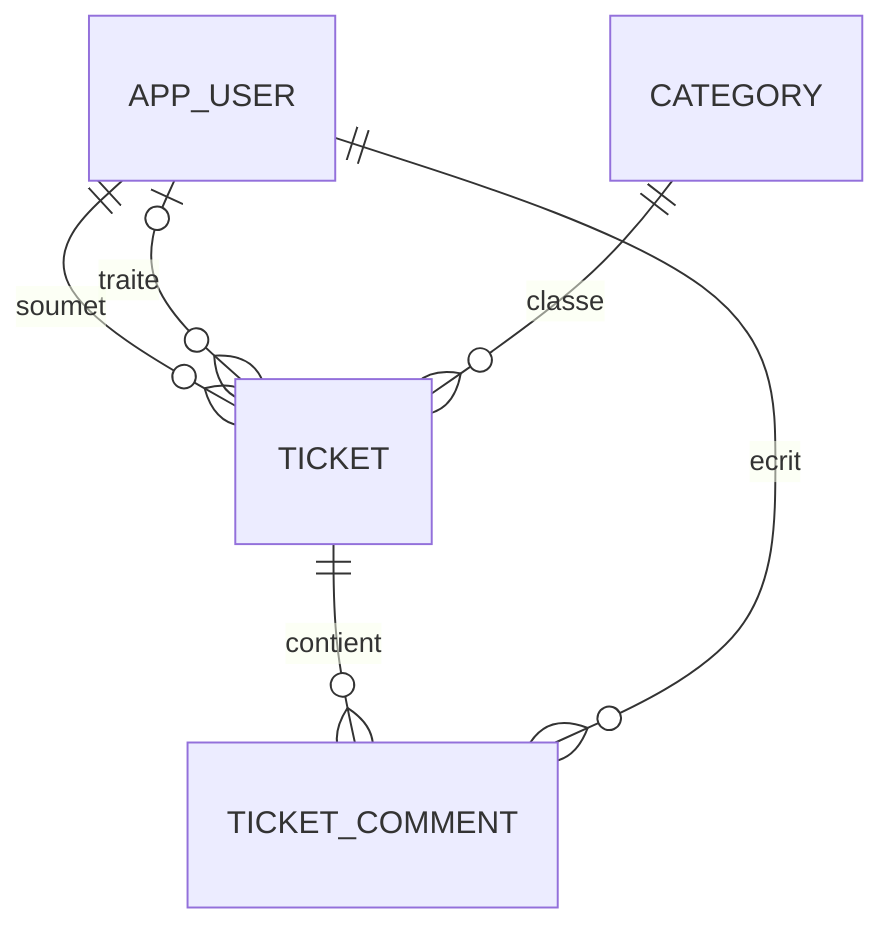

# Suivi des demandes informatiques

Application web permettant à un collaborateur de signaler un problème informatique et à un technicien de suivre sa résolution.

Exemple entièrement fictif : Camille Morel signale une imprimante inaccessible. Le technicien Alex Perrin prend en charge la demande, échange avec Camille, puis décrit la solution appliquée.

## Objectif pédagogique

Construire une application complète et explicable, en mettant l'accent sur Java et Spring Boot. Le projet doit permettre de pratiquer les règles métier, les relations entre données, les autorisations et les tests.

| Technologie | Utilisation prévue |
| --- | --- |
| Java et Spring Boot | API REST et règles métier |
| Spring Data JPA | Accès aux données et relations entre entités |
| PostgreSQL | Stockage et contraintes d'intégrité |
| Angular et TypeScript | Écrans, formulaires et appels HTTP |
| Spring Security | Authentification et contrôle des accès |
| JUnit et Mockito | Tests unitaires des règles métier |
| Docker Compose | Démarrage de PostgreSQL en développement |

Les versions et commandes d'installation seront renseignées lors de l'initialisation du dépôt, après vérification de leur compatibilité.

## MVP

Le MVP est une première version utilisable. La version complète prolonge ce même code et cette même base de données.

| Fonctionnalité | MVP | Version complète |
| --- | --- | --- |
| Connexion et déconnexion | Oui | Oui |
| Deux rôles | Collaborateur et technicien | Identiques |
| Visibilité des demandes | Collaborateur : les siennes ; technicien : toutes | Identique |
| Création d'une demande | Titre, description, catégorie | Identique |
| Liste et filtres | Statut, catégorie | Ajout de recherche, pagination et tri |
| Affectation | Un technicien par demande | Réaffectation tracée dans l'historique |
| Cycle de traitement | Ouverte, en cours, résolue, réouverture | Identique |
| Commentaires | Publics aux personnes autorisées sur la demande | Identiques |
| Résolution | Explication et date | Conservation de chaque résolution dans l'historique |
| Réouverture | Motif conservé comme commentaire spécifique | Événement structuré et consultable |
| Historique détaillé | Non | Création, statuts et affectations |
| Priorité | Non | Basse, normale, haute |
| Tableau de bord | Non | Compteurs par statut et demandes affectées au technicien connecté |
| Modification simultanée | À gérer dans la version complète | Détection par version de la demande |
| Validation | Tests métier et contrôles d'accès | Ajout de tests d'intégration et de parcours complets |

Les pièces jointes, notifications par courriel, engagements de délai et gestion multi-entreprises restent hors périmètre. Les comptes et catégories sont initialisés avec des données fictives ; aucune interface d'administration ni inscription publique n'est prévue.

## Rôles et droits

| Action | Collaborateur | Technicien |
| --- | --- | --- |
| Créer une demande | Oui, pour lui-même | Oui, pour lui-même |
| Lister et consulter | Ses demandes uniquement | Toutes les demandes |
| Ajouter un commentaire | Sur ses demandes | Sur toutes les demandes |
| Affecter ou réaffecter | Non | Oui, à un technicien actif |
| Passer en cours ou résoudre | Non | Oui |
| Rouvrir avec un motif | Ses demandes résolues | Toute demande résolue |
| Consulter l'historique complet | Ses demandes | Toutes les demandes |

Choix de conception : tout technicien peut traiter une demande, même si elle est affectée à un autre technicien. L'affectation désigne le responsable du suivi ; elle ne restreint pas les droits des autres techniciens.

Le serveur vérifie ces droits pour chaque opération. Masquer un bouton dans Angular ne constitue pas un contrôle d'accès. Le demandeur et l'auteur d'une action sont déduits du compte connecté, jamais acceptés librement depuis le formulaire.

## Écrans

La connexion précède les quatre écrans métier.

| Écran | Contenu |
| --- | --- |
| Liste des demandes | Demandes autorisées, statut, catégorie et filtres |
| Nouvelle demande | Titre, description et catégorie |
| Détail d'une demande | Informations, demandeur, technicien, commentaires et résolution |
| Traitement | Affectation, prise en charge et résolution ; réservé aux techniciens |

La réouverture est accessible depuis le détail. La version complète ajoute l'historique au détail et les compteurs à la liste, sans imposer de nouvel écran métier.

## Règles métier

Une demande possède un titre de 3 à 150 caractères et une description de 10 à 5 000 caractères. Les valeurs composées uniquement d'espaces sont refusées. Une catégorie existante et active est obligatoire.

À la création, le statut est `OUVERTE`, le demandeur est le compte connecté et aucun technicien n'est affecté. Les dates sont produites par le serveur.

| Transition autorisée | Condition | Effet |
| --- | --- | --- |
| `OUVERTE` → `EN_COURS` | Technicien actif affecté | Début du traitement |
| `EN_COURS` → `RESOLUE` | Explication non vide de 10 à 5 000 caractères | Enregistrement de la résolution et de sa date |
| `RESOLUE` → `OUVERTE` | Motif non vide de 10 à 5 000 caractères | Réouverture et retrait de l'affectation |

Les autres transitions sont refusées, y compris la résolution directe d'une demande ouverte. Une affectation seule ne change pas le statut. Une demande en cours ne peut pas perdre son technicien ; elle peut être réaffectée à un autre technicien actif. Une demande résolue doit être rouverte avant toute réaffectation.

Au moment de la réouverture, l'ancienne résolution est conservée dans un commentaire système pour le MVP, puis dans l'historique pour la version complète. Les champs de résolution courante sont ensuite vidés. Le motif est conservé et lié à l'auteur de la réouverture. Ces écritures sont réalisées dans une même transaction.

Un commentaire contient entre 1 et 5 000 caractères utiles. Les commentaires restent possibles après résolution, sans changer le statut. Ils ne sont ni modifiables ni supprimables dans ce périmètre.

Les demandes ne sont pas supprimées. Les comptes et catégories devenus inutiles sont désactivés pour conserver les références existantes. Dans cette version, leur désactivation se fait hors interface et nécessite de réaffecter préalablement les demandes ouvertes ou en cours du technicien concerné.

## Base de données du MVP

Quatre tables suffisent. Les champs sont nommés en anglais pour rester cohérents avec le code ; les libellés de l'interface sont en français.

Une clé primaire (`PK`) identifie une ligne. Une clé étrangère (`FK`) référence une ligne d'une autre table. Sauf mention « nullable », les champs sont obligatoires.

### `app_user` — comptes

| Champ | Type PostgreSQL | Rôle et contraintes |
| --- | --- | --- |
| `id` | BIGINT | PK, identité générée |
| `display_name` | VARCHAR(100) | Nom fictif affiché |
| `email` | VARCHAR(254) | Identifiant unique, normalisé en minuscules |
| `password_hash` | VARCHAR(255) | Empreinte du mot de passe, jamais le mot de passe en clair |
| `role` | VARCHAR(20) | `COLLABORATEUR` ou `TECHNICIEN` |
| `active` | BOOLEAN | Vrai par défaut |
| `created_at` | TIMESTAMPTZ | Date de création |

Un compte possède un seul rôle. Une table de rôles distincte n'est pas nécessaire pour ces deux valeurs fixes. Les mots de passe hachés ne sont jamais renvoyés par l'API.

### `category` — catégories

| Champ | Type PostgreSQL | Rôle et contraintes |
| --- | --- | --- |
| `id` | BIGINT | PK, identité générée |
| `name` | VARCHAR(80) | Nom unique et non vide |
| `active` | BOOLEAN | Vrai par défaut |

Catégories fictives de départ : matériel, logiciel, réseau et accès aux comptes. Une catégorie désactivée reste visible sur les anciennes demandes mais ne peut plus être choisie à la création.

### `ticket` — demandes

| Champ | Type PostgreSQL | Rôle et contraintes |
| --- | --- | --- |
| `id` | BIGINT | PK, identité générée |
| `title` | VARCHAR(150) | Titre |
| `description` | TEXT | Description du problème |
| `status` | VARCHAR(20) | `OUVERTE`, `EN_COURS` ou `RESOLUE` |
| `requester_id` | BIGINT | FK → `app_user.id`, demandeur |
| `assignee_id` | BIGINT | FK → `app_user.id`, technicien, nullable |
| `category_id` | BIGINT | FK → `category.id` |
| `resolution` | TEXT | Résolution courante, nullable hors statut résolu |
| `created_at` | TIMESTAMPTZ | Création |
| `updated_at` | TIMESTAMPTZ | Dernière modification métier, commentaires compris |
| `resolved_at` | TIMESTAMPTZ | Date de résolution courante, nullable |

Le demandeur et le technicien référencent la même table de comptes, mais remplissent deux fonctions différentes. Une demande possède exactement un demandeur et au maximum un technicien.

### `ticket_comment` — échanges et traces minimales

| Champ | Type PostgreSQL | Rôle et contraintes |
| --- | --- | --- |
| `id` | BIGINT | PK, identité générée |
| `ticket_id` | BIGINT | FK → `ticket.id` |
| `author_id` | BIGINT | FK → `app_user.id` |
| `kind` | VARCHAR(30) | `COMMENTAIRE`, `REOUVERTURE` ou `RESOLUTION_ARCHIVEE` |
| `content` | TEXT | Contenu non vide |
| `created_at` | TIMESTAMPTZ | Date d'enregistrement |

Le serveur produit les types spéciaux ; l'utilisateur ne peut envoyer que des commentaires ordinaires. Lors d'une réouverture MVP, le commentaire `RESOLUTION_ARCHIVEE` copie la résolution précédente et sa date ; son auteur est le compte qui déclenche cet archivage, pas nécessairement celui qui avait résolu la demande. Le MVP ne fournit donc pas un audit complet des anciens traitements.

### Relations



## Base de données de la version complète

La version complète conserve les quatre tables et ajoute `ticket_event`. Il n'est pas nécessaire de créer une deuxième base.

Deux champs sont ajoutés à `ticket`.

| Champ | Type PostgreSQL | Rôle |
| --- | --- | --- |
| `priority` | VARCHAR(10) | `BASSE`, `NORMALE`, `HAUTE` ; normale par défaut, modifiable par les techniciens |
| `version` | BIGINT | Numéro utilisé pour détecter les modifications concurrentes |

### `ticket_event` — historique structuré

| Champ | Type PostgreSQL | Rôle et contraintes |
| --- | --- | --- |
| `id` | BIGINT | PK, identité générée |
| `ticket_id` | BIGINT | FK → `ticket.id` |
| `actor_id` | BIGINT | FK → `app_user.id`, compte à l'origine de l'action |
| `event_type` | VARCHAR(30) | `CREATION`, `STATUT`, `AFFECTATION` ou `PRIORITE` |
| `old_status` | VARCHAR(20) | Ancien statut, nullable |
| `new_status` | VARCHAR(20) | Nouveau statut, nullable |
| `old_assignee_id` | BIGINT | FK → `app_user.id`, nullable |
| `new_assignee_id` | BIGINT | FK → `app_user.id`, nullable |
| `old_priority` | VARCHAR(10) | Ancienne priorité, nullable |
| `new_priority` | VARCHAR(10) | Nouvelle priorité, nullable |
| `reason` | TEXT | Motif obligatoire pour une réouverture, sinon nullable |
| `resolution_snapshot` | TEXT | Copie obligatoire de la résolution lors du passage à `RESOLUE`, sinon nullable |
| `created_at` | TIMESTAMPTZ | Date de l'action |

Les champs renseignés dépendent du type d'événement. À la création, `new_status` vaut `OUVERTE`. Un événement `STATUT` conserve l'ancien et le nouveau statut. Un événement `AFFECTATION` conserve les deux techniciens, dont l'un peut être absent. Un événement `PRIORITE` conserve les deux priorités. Les champs étrangers au type d'événement restent nuls.

Chaque résolution reste ainsi disponible même après plusieurs réouvertures. Une réouverture produit un événement de statut et, si nécessaire, un événement de retrait d'affectation. L'ensemble est enregistré avec la modification de la demande dans une seule transaction. L'historique est consultable, mais n'est ni modifiable ni supprimable par l'API.

Lors de la migration depuis le MVP, les commentaires spéciaux existants sont conservés. Les nouveaux changements utilisent l'historique structuré ; aucun auteur ni ancien statut manquant n'est inventé pour reconstituer le passé.

### Intégrité et index

Prévoir des contraintes `NOT NULL`, `UNIQUE`, `CHECK` et des clés étrangères. Les contraintes vérifient notamment les valeurs autorisées des rôles et statuts, les textes obligatoires non blancs et les invariants suivants.

| Invariant | Contrôle |
| --- | --- |
| Statut en cours ou résolu | `assignee_id` renseigné |
| Statut résolu | Résolution non vide et `resolved_at` renseigné |
| Statut ouvert ou en cours | `resolution` et `resolved_at` nuls |
| Technicien affecté | Compte existant, actif et de rôle technicien |
| Accès d'un collaborateur | `requester_id` égal à l'identifiant du compte connecté |

Les trois premiers peuvent être vérifiés par des contraintes sur `ticket`. Le rôle et l'activité du technicien, les droits et les transitions sont vérifiés dans le service Java, car ils nécessitent d'autres données ou l'ancien état.

Indexer `ticket.requester_id`, `ticket.assignee_id`, `ticket.status`, `ticket.category_id`, ainsi que `(ticket_id, created_at, id)` sur les commentaires et événements. Adapter ensuite les index aux requêtes réellement utilisées. Les clés étrangères utilisent une suppression restrictive pour éviter de perdre les relations historiques.

## Organisation du code prévue

| Dossier | Responsabilité |
| --- | --- |
| `backend/` | Application Spring Boot |
| `frontend/` | Application Angular |
| `backend/.../controller/` | Routes HTTP, validation des entrées et réponses |
| `backend/.../service/` | Autorisations métier, transitions et transactions |
| `backend/.../repository/` | Accès à PostgreSQL |
| `backend/.../entity/` | Entités persistées |
| `backend/.../dto/` | Objets d'entrée et de sortie de l'API |
| `backend/.../security/` | Connexion et configuration des accès |
| `backend/.../exception/` | Format commun des erreurs |

Les entités JPA ne sont pas renvoyées directement au frontend. Les DTO exposent uniquement les champs utiles et empêchent notamment de modifier librement le demandeur, le rôle ou les dates.

Choix d'authentification proposé : session côté serveur avec cookie HttpOnly, protection CSRF pour les actions et cookie Secure en HTTPS. Angular et l'API seront servis sous une même origine, avec un proxy en développement. Les comptes fictifs sont préparés à l'initialisation ; il n'y a pas de choix libre du rôle au moment de la connexion.

## API envisagée

Il s'agit du contrat cible, à implémenter et documenter précisément dans le code.

| Méthode | Route | Action |
| --- | --- | --- |
| POST | `/api/auth/login` | Ouvrir une session |
| POST | `/api/auth/logout` | Fermer la session |
| GET | `/api/auth/me` | Lire le compte connecté |
| GET | `/api/categories` | Catégories disponibles |
| GET | `/api/technicians` | Techniciens actifs, accès technicien |
| GET | `/api/tickets` | Liste filtrée selon les droits |
| POST | `/api/tickets` | Créer pour le compte connecté |
| GET | `/api/tickets/{id}` | Consulter une demande autorisée |
| GET | `/api/tickets/{id}/comments` | Lire les commentaires autorisés |
| POST | `/api/tickets/{id}/comments` | Ajouter un commentaire |
| PATCH | `/api/tickets/{id}/assignment` | Affecter ou réaffecter un technicien |
| POST | `/api/tickets/{id}/start` | Passer en cours |
| POST | `/api/tickets/{id}/resolve` | Résoudre avec une explication |
| POST | `/api/tickets/{id}/reopen` | Rouvrir avec un motif |
| GET | `/api/tickets/{id}/events` | Historique, version complète |
| PATCH | `/api/tickets/{id}/priority` | Modifier la priorité, version complète |
| GET | `/api/dashboard` | Compteurs selon les droits, version complète |

La liste accepte `status` et `categoryId`. La version complète ajoute `search`, `page`, `size` et un tri limité à des champs autorisés. Les filtres ne peuvent jamais élargir les droits du compte connecté.

Codes d'erreur prévus : `400` pour un formulaire invalide, `401` sans connexion, `403` pour une action interdite par le rôle, `404` pour une demande inexistante ou invisible au compte connecté, `409` pour une transition incompatible avec l'état courant ou un conflit de version.

Dans la version complète, chaque modification transmet la version connue de la demande. Le serveur la compare à la version courante et utilise également le verrouillage optimiste JPA pour détecter deux écritures concurrentes. En cas de conflit, l'interface propose de recharger les informations.

## Tests à prévoir

| Situation | Résultat attendu |
| --- | --- |
| Création valide | Demande ouverte, liée au compte connecté |
| Titre vide ou description composée d'espaces | Refus |
| Passage en cours sans technicien | Refus |
| Affectation à un collaborateur ou compte inactif | Refus |
| Résolution directe depuis ouverte | Refus |
| Résolution sans explication | Refus |
| Réouverture sans motif | Refus |
| Réouverture valide | Statut ouvert, affectation retirée, ancienne résolution conservée |
| Collaborateur consultant la demande d'un autre | Aucun accès, y compris aux commentaires et événements |
| Collaborateur appelant une route de traitement | Refus côté API |
| Échec de l'écriture d'un événement | Aucune modification partielle de la demande |
| Deux modifications concurrentes, version complète | Conflit explicite, aucune écriture silencieusement écrasée |

JUnit et Mockito servent à tester les services et leurs dépendances. Des tests d'intégration de l'API vérifient réellement la session, les autorisations et les contraintes PostgreSQL. Les scénarios seront considérés comme validés uniquement après exécution des tests correspondants.

## Données de démonstration

| Compte fictif | Rôle | Adresse fictive |
| --- | --- | --- |
| Camille Morel | Collaborateur | camille.morel@example.test |
| Noa Rivière | Collaborateur | noa.riviere@example.test |
| Alex Perrin | Technicien | alex.perrin@example.test |
| Sam Laurent | Technicien | sam.laurent@example.test |

Préparer quelques demandes dans chaque statut, par exemple « Imprimante du bureau inaccessible », « Application de démonstration bloquée » et « Connexion au réseau de test impossible ». Prévoir au moins une demande par collaborateur pour vérifier l'isolation des accès et une demande résolue à rouvrir.

## Ordre de réalisation

1. Initialiser Spring Boot et PostgreSQL, puis créer les quatre tables du MVP.
2. Préparer les comptes fictifs, la connexion et les contrôles d'accès.
3. Développer la création, la liste et le détail des demandes.
4. Ajouter affectation, transitions, commentaires et réouverture, avec leurs tests.
5. Construire les quatre écrans Angular et vérifier le parcours avec les deux rôles.
6. Documenter les commandes de démarrage et terminer une démonstration reproductible du MVP.
7. Faire évoluer la base par migrations pour ajouter historique, priorité et version.
8. Ajouter recherche, pagination, compteurs et tests de la version complète.

## Critères de réussite

**MVP terminé** : deux collaborateurs ne voient pas les demandes l'un de l'autre ; un technicien voit les deux, prend en charge et résout une demande ; son demandeur la rouvre avec un motif ; les règles sont contrôlées par l'API et les données subsistent après redémarrage.

**Version complète terminée** : chaque nouvelle transition et affectation est datée et attribuée, les résolutions successives sont conservées, les listes sont paginées, les filtres respectent les droits et deux modifications concurrentes ne s'écrasent pas silencieusement.

## Installation et avancement

Le backend Spring Boot possède une route `/api/health`, une connexion PostgreSQL et une première entité `Category`. Hibernate crée la table `category` au démarrage ; les autres tables métier restent à implémenter.

Prérequis : Docker avec Docker Compose, un JDK 17 et Gradle 9.7.1 (version configurée dans le projet). Le fichier `gradle-wrapper.jar` n'est pas présent dans le dépôt : les commandes ci-dessous utilisent donc Gradle installé localement.

Depuis la racine du dépôt, démarrer la base et attendre qu'elle soit prête :

```bash
docker compose up -d --wait postgres
```

Puis démarrer le backend :

```bash
cd backend
gradle bootRun
```

PostgreSQL est accessible sur `localhost:5432`, avec la base `gestion_tickets`, l'utilisateur `gestion_tickets` et le mot de passe de développement `gestion_tickets_dev`. Ces identifiants servent uniquement au développement local. Pour les remplacer, exporter `POSTGRES_USER` et `POSTGRES_PASSWORD` dans le terminal utilisé pour Compose et Spring Boot avant la première initialisation. Spring Boot accepte aussi `SPRING_DATASOURCE_URL` pour une autre adresse de base. Un fichier `.env` lu par Compose n'est pas automatiquement lu par Spring Boot.

Pour ouvrir une console SQL depuis la racine :

```bash
docker compose exec postgres sh -c 'psql -U "$POSTGRES_USER" -d "$POSTGRES_DB"'
```

Exécuter `SELECT current_database();` pour vérifier la base courante. Après le démarrage de Spring Boot, `\d category` affiche la table créée par Hibernate. Utiliser `\q` pour quitter.

Pour lancer le test d'intégration, conserver PostgreSQL démarré puis exécuter depuis `backend/` :

```bash
gradle test --tests fr.armand.backend.BackendApplicationTests
```

Les tests chargent Spring Boot, vérifient la connexion PostgreSQL, puis enregistrent et relisent une catégorie avec JPA. La catégorie de test est annulée à la fin du test grâce à une transaction.

Pour arrêter la base, utiliser `docker compose down` depuis la racine. Le volume nommé conserve les données ; `docker compose down -v` les supprime. Les variables d'initialisation PostgreSQL ne changent pas les comptes d'un volume déjà initialisé.

La connexion se compose de trois éléments : le **serveur PostgreSQL** stocke les données, le **pilote JDBC** permet à Java de lui parler, et **Spring Data JPA** permettra de manipuler les futures entités Java via des repositories. Spring Boot configure automatiquement un `DataSource` (un ensemble de connexions réutilisables) à partir des propriétés `spring.datasource`.

`spring.jpa.hibernate.ddl-auto=update` demande à Hibernate de créer les tables manquantes et d'adapter leur structure aux entités au démarrage, sans les recréer systématiquement. Ce choix simplifie l'apprentissage ; il ne gère pas toutes les évolutions, notamment les renommages, comme le ferait une migration explicite. `spring.jpa.open-in-view=false` évite de garder une session JPA ouverte pendant toute la réponse HTTP ; les accès aux données devront être réalisés dans les services et leurs transactions.

Dans `Category.java`, `@Entity` indique qu'un objet Java correspond à une ligne en base. `@Table` donne le nom de la table, `@Id` désigne son identifiant et `@GeneratedValue` confie sa génération à PostgreSQL. `@Column` précise les contraintes : le nom est obligatoire, unique et limité à 80 caractères. Le champ `active` vaut `true` pour une nouvelle catégorie créée en Java. Aucune insertion manuelle ni route HTTP n'est nécessaire pour créer la table : démarrer Spring Boot suffit.

Pour présenter le projet, expliquer un parcours complet, une règle métier testée, la différence entre demandeur et technicien affecté, et la manière dont le serveur empêche un accès non autorisé. Décrire honnêtement les fonctionnalités réalisées et celles restant à développer.
